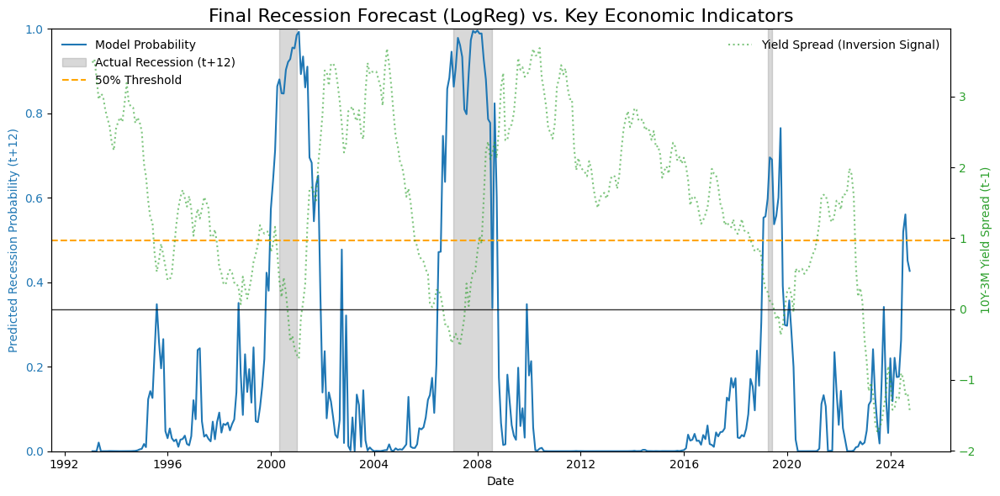

# Economic Indicators Forecasting and Recession Prediction

This project implements a complete pipeline for analyzing, modeling, and forecasting key **United States macroeconomic indicators** and building a **recession classification model**.

It utilizes publicly available data from the Federal Reserve Economic Data (FRED) and employs time series and machine learning techniques to provide timely economic insights.

-----

## Project Overview

This notebook focuses on two main objectives:

1.  **Macroeconomic Forecasting:** Employing **Vector Autoregression (VAR)** and **ARIMA** models to predict short-term movements in a system of core economic variables.
2.  **Recession Classification:** Training a machine learning model (**Logistic Regression** and **XGBoost**) to forecast the probability of a US recession **12 months ahead**.

The entire analysis, from data collection and cleaning to model validation and feature importance, is performed using a **walk-forward validation** approach to simulate real-world forecasting accuracy.

-----

## Methodology and Models

### 1\. Data Collection and Preparation

  * **Source:** Monthly time series data fetched directly from **FRED** (Federal Reserve Economic Data).
  * **Key Indicators Used:** GDP (Quarterly), CPI (Inflation), Unemployment Rate (UNRATE), Federal Funds Rate (FEDFUNDS), Leading Economic Index (LEI), 10-Year and 3-Month Treasury Yields.
  * **Feature Engineering:**
      * Calculated Year-over-Year (YoY) Inflation and YoY GDP.
      * Created the Yield Curve Spread (10y - 3mo), a well-known recession predictor.
      * Engineered recession classification features, including the 6-month change in UNRATE and the 12-month change in FEDFUNDS.

### 2\. Time Series Forecasting

  * **VAR Model:** A multivariate **Vector Autoregression (VAR)** model was applied to forecast the system of macroeconomic variables. A **rolling-window evaluation** (72-month train, 6-month forecast) was implemented, with optimal lag selection determined by the **Bayesian Information Criterion (BIC)**.
  * **ARIMA Model:** `pmdarima`'s `auto_arima` was used to find the best-fitting **Seasonal ARIMA** model for the Unemployment Rate (UNRATE).
  * **Stationarity:** The Augmented Dickey-Fuller (**ADF**) test was performed on all series, and the non-stationary Yield Curve Spread was **first-differenced** to ensure reliable VAR modeling.

### 3\. Recession Prediction (Classification)

  * **Target:** The official **US Recession Indicator (USREC)** was lagged by 12 months to create a prediction target: *Is a recession expected 12 months from now?*.
  * **Models:** **Logistic Regression** and **XGBoost** were used for comparison.
  * **Validation:** A **walk-forward validation** approach was used to test the model's predictive power over time, maintaining a realistic forecasting environment.
  * **Evaluation:** Model performance was primarily measured using the **ROC AUC score**. The final Logistic Regression model's **coefficients** were extracted to interpret the most influential features (e.g., lagged yield spread and unemployment changes).

-----

## Required Libraries

To run this notebook, you will need the following Python libraries:

```bash
pip install pandas numpy matplotlib seaborn statsmodels scikit-learn xgboost pmdarima pandas-datareader shap
```

-----

## Key Results and Findings

### 1. Recession Classification Performance

The primary goal of the project was to create a reliable 12-month-ahead recession forecast. The final **Logistic Regression** model proved to be highly effective in out-of-sample prediction:

* **ROC AUC Score (Out-of-Sample):** 0.8528
* **Feature Importance:** Analysis of the Logistic Regression coefficients confirmed that:

| Feature | Lag | Impact on Recession Risk | Economic Interpretation |
|---------|-----|-------------------------|------------------------|
| **LEI (Leading Economic Index)** | 3 months ago | **Strong Negative** | A healthy LEI three months ago signals strong economic activity, **reducing the probability of a recession** one year out. |
| **YC Spread (10Y – 3M Treasury)** | 12 months ago | **Strong Negative** | A steep yield curve twelve months ago indicates strong long-term growth expectations, acting as the largest single **brake on recession probability** today. |
| **Federal Funds Rate Change (12M)** | 1 & 3 months ago | **Positive** | A significant increase in the Fed Funds Rate over the past year (**monetary tightening**) is associated with a **higher probability of recession**, reflecting efforts to cool an overheating economy. |

### 2. Time Series Forecasting

* **VAR Accuracy:** Overall, the VAR model captures the general dynamics well, though more volatile indicators like GDP and unemployment are harder to predict accurately.
  - **GDP YoY:** RMSE ~0.85, smaller than typical growth swings (~1.5%), indicating reasonable short-term accuracy.
  - **Unemployment Rate:** RMSE ~0.63, comparable to its typical variation (~0.63), suggesting moderate forecast reliability.
  - **FEDFUNDS & LEI:** RMSEs are smaller than typical changes, showing strong predictability.
  - **YC Spread Diff:** Forecast errors are roughly the same magnitude as typical movements, reflecting moderate precision.

| Variable        | Average RMSE |
|-----------------|--------------|
| GDP YoY         | 0.85         |
| Inflation YoY   | 0.92         |
| Unemployment    | 0.63         |
| FEDFUNDS        | 0.47         |
| LEI             | 0.39         |
| YC Spread Diff  | 0.25         |


* **ARIMA UNRATE Forecast:** The `auto_arima` model for the Unemployment Rate achieved an RMSE of 1.930.
  - The model was tested across 63 periods (from 1994 to 2025), showing a reliable, long-term predictive error metric. The high variability in the chosen order (e.g., from simple ARIMA(0, 1, 0) to complex ARIMA}(3, 1, 2)) highlights the need for dynamic model selection across different economic regimes.

### 3. Visualizations

* **Recession Probability Plot:** A chart showing the model's **probability of recession (t+12)** over time, overlaid with the actual NBER recession periods and the **Yield Curve Inversion** signal. This is the most compelling result.



***

**Key Dependencies:**

  * `statsmodels.tsa.api` for VAR modeling.
  * `pmdarima` for automated ARIMA model selection.
  * `sklearn.linear_model.LogisticRegression` and `xgboost.XGBClassifier` for classification.
  * `shap` for model interpretability.
